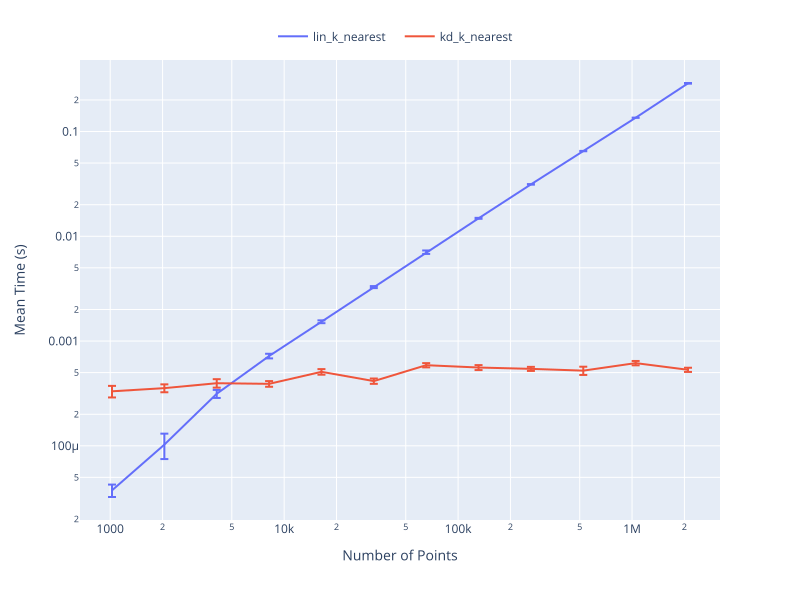

# arbol-KD 🇪🇸

**arbol-kd** is a high-performance KD-tree library designed for use from Python, with a core implementation in C++ for speed and efficiency. The library supports both standard and periodic boundary conditions, making it suitable for scientific computing, computational physics, and materials science applications where periodicity is essential.

## Features

- **Fast KD-tree construction and search** using optimized C++ code.
- **Python interface** via [pybind11](https://github.com/pybind/pybind11).
- **Support for periodic boundary conditions** in nearest neighbor and k-nearest neighbor queries.
- **2D and 3D KD-tree support**.
- **NumPy integration** for seamless data handling.

## Requirements
- Python 3.10 or later
- NumPy
- C++ compiler with C++17 support
- pybind11
- CMake
- Eigen3
- TBB (Threading Building Blocks)

### Optional Requirements
- OneAPI DPC++ Library (OneDPL)
  - for parallel execution (for MacOS users, it is required)

## Installation
You can install arbol-kd using pip (after building the wheel):
```sh
pip install git+https://github.com/m12watanabe1a/arbol-kd.git
```

## Usage

```python
import arbol_kd as akd
import numpy as np

# Generate random 3D points
points = np.random.rand(10000, 3)
tree = akd.build_tree_3d(points)

# Query point
query = np.array([0.5, 0.5, 0.5])

# Find k-nearest neighbors
k_nearest = akd.k_nearest(tree, query, k=10)

# Define a periodic box: shape (3, 2), columns are [min, max] for each axis
box = np.array([[0, 1], [0, 1], [0, 1]])

# Periodic k-nearest neighbor search
k_nearest_pbc = akd.k_nearest_periodic(tree, query, box, k=10)

# Clamp points into the periodic box
clamped_points = akd.clamp2periodic_box(points, box)
```

## Benchmark

